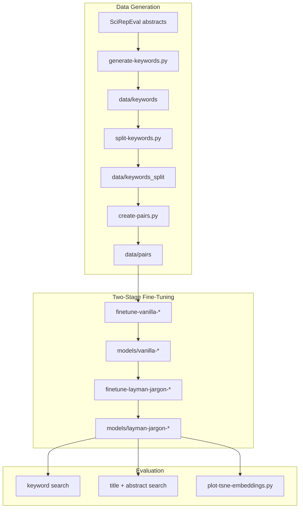

# LaySciSearch — Layman-to-Jargon Embedding Alignment for Scientific Retrieval

End-to-end pipeline that uses an LLM teacher to synthesize training data, fine-tunes embedding models with contrastive learning (full fine-tune + QLoRA), and evaluates cross-register retrieval on a held-out benchmark.

**Python** · **PyTorch** · **CUDA** · **Sentence Transformers** · **HuggingFace Datasets** · **PEFT/LoRA** · **Unsloth** · **vLLM** · **Contrastive learning** (`CachedMultipleNegativesRankingLoss`) · **Vector retrieval** (cosine similarity / semantic search) · **SciBERT** · **Qwen3-Embedding-0.6B**

|             |                                                                                                |
| ----------- | ---------------------------------------------------------------------------------------------- |
| **Dataset** | [SciRepEval / SciDocs Mag Mesh](https://huggingface.co/datasets/allenai/scirepeval)            |
| **Paper**   | [Paper (Google Drive)](https://drive.google.com/file/d/1sJ5-R6tSsUxIEDq6oxzR6KNDtkNLiDsL/view) |

---

## Problem

Non-experts search scientific literature with plain-language terms; embedding models trained on domain text retrieve poorly across the layman↔jargon vocabulary gap. Full RAG stacks solve this implicitly but add latency, cost, and failure modes. This project builds a **lightweight retrieval layer**—small embedding models aligned for cross-register search without per-query LLM calls.

---

## What I Built

- **Data pipeline:** LLM-based keyword synthesis → train/val/test split → 7-type contrastive pair generator (~705 pairs/paper)
- **Training:** Two-stage fine-tuning for two model families (SciBERT full fine-tune; Qwen QLoRA via Unsloth)
- **Evaluation harness:** Three retrieval tasks with MRR/Recall; fair comparison script for Qwen precision variants ([`qwen_fair_eval.py`](qwen_fair_eval.py))
- **Visualization:** PCA→t-SNE embedding-space plots for qualitative validation
- **Shared library:** [`utils.py`](utils.py) — dataset loaders, pair filtering, Qwen/LoRA loading, eval DataFrame builders

---

## System Architecture



### Two-stage training

1. **Stage 1 (vanilla):** Broad contrastive retrieval — keywords↔documents and cross-register pairs. The Qwen path excludes same-language keyword pairs and upsamples `layman-jargon` 2× ([`utils.py`](utils.py) `VANILLA_PAIR_TYPES_FILTERED`).
2. **Stage 2 (layman-jargon):** Domain-alignment pass on cross-register keyword pairs only, initialized from the Stage 1 checkpoint.

### Training pair types

[`create-pairs.py`](create-pairs.py) expands each paper's keywords into seven contrastive pair types:

| Pair type         | Anchor         | Positive               | Purpose                       |
| ----------------- | -------------- | ---------------------- | ----------------------------- |
| `layman-jargon`   | layman term    | matching jargon        | Core cross-register alignment |
| `jargon-jargon`   | jargon keyword | sibling jargon keyword | Same-register clustering      |
| `layman-layman`   | layman keyword | sibling layman keyword | Same-register clustering      |
| `jargon-title`    | jargon keyword | paper title            | Query → title retrieval       |
| `layman-title`    | layman keyword | paper title            | Query → title retrieval       |
| `jargon-abstract` | jargon keyword | abstract               | Query → document retrieval    |
| `layman-abstract` | layman keyword | abstract               | Query → document retrieval    |

Each paper yields **705 pairs** (15 keywords × combinatorial pairings + keyword↔title/abstract links).

---

## Engineering Decisions

| Decision                           | Rationale                                                                                                                                                       |
| ---------------------------------- | --------------------------------------------------------------------------------------------------------------------------------------------------------------- |
| LLM teacher for labels             | Removes manual annotation; 15 jargon↔layman pairs/paper across core entities, methodologies, and outcomes                                                       |
| Keywords over summaries            | Higher information density, fewer tokens (Information Bottleneck motivation in [paper](https://drive.google.com/file/d/1sJ5-R6tSsUxIEDq6oxzR6KNDtkNLiDsL/view)) |
| Two-stage fine-tuning              | Stage 1 learns retrieval structure; Stage 2 specializes cross-register alignment without diluting signal                                                        |
| SciBERT + Qwen comparison          | Domain-specific ~110M model vs general ~600M embedding model; tests whether specialization or scale wins on limited data                                        |
| QLoRA for Qwen                     | ~0.19% trainable params; bf16 LoRA default for 16GB GPU utilization ([`finetune-vanilla-qwen.py`](finetune-vanilla-qwen.py))                                    |
| `encode_query` / `encode_document` | Qwen3-Embedding asymmetric encoding for query vs corpus at eval time                                                                                            |
| HF Datasets on disk                | Reproducible splits; `data/pairs` and `data/keywords_split` are versionable artifacts                                                                           |

---

## Results

Evaluated on a held-out test set (67 papers). Best model in **bold**.

| Model                     | Layman→Jargon MRR@15 | Layman→Abstract MRR@5 | Layman→Title MRR@5 |
| ------------------------- | -------------------- | --------------------- | ------------------ |
| Base SciBERT              | 0.32                 | 0.25                  | 0.15               |
| vanilla-scibert           | 0.57                 | 0.89                  | 0.73               |
| **layman-jargon-scibert** | **0.61**             | **0.97**              | **0.90**           |
| Base Qwen                 | 0.60                 | 0.65                  | 0.39               |
| vanilla-qwen              | 0.58                 | 0.64                  | 0.39               |
| layman-jargon-qwen        | 0.58                 | 0.64                  | 0.39               |

**Recall@k** (best model): Layman→Jargon Recall@15 **0.99** · Layman→Abstract Recall@5 **0.99** · Layman→Title Recall@5 **0.99**

Two-stage SciBERT fine-tuning nearly **doubled** layman→jargon MRR and **3–6×** document-retrieval MRR vs the base model. Qwen's stronger zero-shot baseline did not improve further at this dataset size—a documented finding in the [paper](https://drive.google.com/file/d/1sJ5-R6tSsUxIEDq6oxzR6KNDtkNLiDsL/view).

---

## Repository Map

```
# Data
generate-keywords.py    # vLLM batch inference → per-paper JSON
split-keywords.py       # 90/5/5 train/val/test split
create-pairs.py         # 7 pair types → HF DatasetDict

# Training
finetune-vanilla-scibert.py
finetune-vanilla-qwen.py
finetune-layman-jargon-scibert.py
finetune-layman-jargon-qwen.py

# Evaluation & visualization
keyword_search_evaluation.py   # layman query → jargon corpus
title_search_evaluation.py     # layman query → paper titles
abstract_search_evaluation.py  # layman query → abstracts
qwen_fair_eval.py              # all Qwen checkpoints × all tasks
plot-tsne-embeddings.py

# Shared
utils.py
data/keywords/          # per-paper JSON (LLM-generated)
data/keywords_split/    # HF DatasetDict on disk
data/pairs/             # HF DatasetDict on disk
models/                 # checkpoints (gitignored — train locally)
plots/                  # t-SNE output (gitignored)
```

---

## Running the Pipeline

**Requirements:** NVIDIA GPU + CUDA (tested with ~16GB VRAM for Qwen bf16 LoRA) · Python 3.12+

```bash
pip install -r requirements.txt

# 1. Generate keywords (skip if data/keywords/ already populated)
python generate-keywords.py

# 2. Split and build contrastive pairs
python split-keywords.py
python create-pairs.py

# 3. Fine-tune (SciBERT example; see Qwen scripts for LoRA flags)
python finetune-vanilla-scibert.py
python finetune-layman-jargon-scibert.py

# 4. Evaluate
python keyword_search_evaluation.py models/layman-jargon-scibert
python title_search_evaluation.py models/layman-jargon-scibert
python abstract_search_evaluation.py models/layman-jargon-scibert
python qwen_fair_eval.py   # compare all Qwen checkpoints

# 5. Visualize embedding space
python plot-tsne-embeddings.py --model-path models/layman-jargon-scibert
```

Training scripts support additional flags (`--bf16-lora`, `--merge-lora`, `--4bit-lora`, etc.) — run with `--help` for details.

---

## Scope & Limitations

- Trained and evaluated on a **subset** of SciRepEval (~250 SciBERT / ~200 Qwen train documents, 67 test — see paper §5.1). The keyword generator defaults to 1,000 abstracts ([`generate-keywords.py`](generate-keywords.py)).
- Research prototype, not production-hardened (no serving layer, auth, or search index).
- Designed as a **search augmentation component** (query expansion or lightweight retriever), composable with existing systems.

---

## Author

**Adam Podoxin**

- Paper: [LaySciSearch: Bridging Jargon and Layman Keywords for Scientific Text Retrieval (Google Drive)](https://drive.google.com/file/d/1sJ5-R6tSsUxIEDq6oxzR6KNDtkNLiDsL/view)
- GitHub: https://github.com/AdamPodoxin/layman-scientific-embeddings
